# GitOps workshop for India summit 2021


## Table of Contents
**[Section 1: Application Deployment](#section-1-application-deployment)**<br>
**[Prerequisites](#prerequisites)**<br>
**[Some Theory first](#some-theory-first)**<br>
**[The Gitops principle](##the-gitops-principle)**<br>
**[Key Gitops benefits](#key-gitops-benefits)**<br>
**[Some core concepts](#Some-core-concepts)**<br>
**[Workshop steps](#workshop-steps)**<br>
**[The workflow](#the-workflow)**<br>
**[Environment setup](#environment-setup)**<br>
**[Event Engine CloudFormation stack output](#event-engine-cloudformation-stack-output)**<br>
**[Default AWS Cloud9 IDE view](#default-aws-cloud9-ide-view)**<br>
**[Configure GitHub SSH Key](#configure-github-ssh-key)**<br>
**[Bootstrap flux tooling](#bootstrap-flux-tooling)**<br>
**[Verify flux is installed and running](#verify-flux-is-installed-and-running)**<br>
**[Fork application demo repository](#fork-application-demo-repository)**<br>
**[Clone the forked Github repo](#clone-the-forked-Github-repo)**<br>
**[Git commit and push](#git-commit-and-push)**<br>
**[Check if the source is reconciled](#check-if-the-source-is-reconciled)**<br>
**[Git commit and push](#git-commit-and-push)**<br>
**[Watch Flux sync the application](#watch-Flux-sync-the-application)**<br>
**[Check deployment](#check-deployment)**<br>
**[Flux reverts cluster changes](#flux-reverts-cluster-changes)**<br>
**[Flux reconciles new git changes](#flux-reconciles-new-git-changes)**<br>
**[Suspend Kustomization reconciliation](#suspend-kustomization-reconciliation)**<br>
**[Resume Kustomization reconciliation](#resume-kustomization-reconciliation)**<br>
**[Undeploy the application](#undeploy-the-application)**<br>
**[Section 2: Image Reconciliation](#section-2-image-reconciliation)**<br>
**[Revert the source and kustomization to redeploy the application](#revert-the-source-and-kustomization-to-redeploy-the-application)**<br>
**[Setup cron job to synchronize ECR login token every 6 hours](#setup-cron-job-to-synchronize-ecr-login-token-every-6-hours)**<br>
**[Create an ImageRepository resource pointing to our private ECR repo](#create-an-`imagerepository`-resource-pointing-to-our-private-ecr-repo)**<br>
**[Clean up application resources](#clean-up-application-resources)**<br>
**[Uninstall flux](#uninstall-flux)**<br>

## Section 1: Application Deployment

**Complexity of this section** : Intermediate (Level 200)

We would like to familiarize you with the basics of  GitOps and demonstrate building a CD pipeline with EKS using the GitOps principles.  We will be using Flux v2 as a gitops operator, which runs in your EKS cluster and tracks changes to one or more Git repositories. These repositories store all manifests that define the desired state of your cluster, Flux will continuously and automatically reconcile the running state of the cluster with the state declared in code.

## Prerequisites

We expect the following prerequisites from the participants:

1. Familiarity with AWS and GIT
2. Working knowledge of Kubernetes/EKS
3. Familiarity with CI/CD concepts

## Some Theory first

 GitOps is a fast and secure method for developers to manage and update complex applications and infrastructure running in Kubernetes.  It is an operations and application deployment workflow and a set of best practices for managing both infrastructure and deployments for cloud-native applications.

### The Gitops principle

1. **Your entire system described declaratively** :  With your entire system’s declarative configuration under source control, you have a single source of truth of your system’s desired state, providing a number of benefits like the ability to simultaneously manage infrastructure and application code.
2. **A desired system state version controlled in Git :** With the declarative definitions of your system stored in Git, and serving as your canonical source of truth, there is a single place from which your cluster can be managed. This also trivializes rollbacks and roll forwards to take you back to a ‘good state’ if needed.
3. **The ability for changes to be automatically applied:** Once the desired system state is kept in Git, the next step is the ability to automatically reconcile changes with your system.
4. **Software agents that verify correct system state and alert on divergence :** With the desired state of your entire system kept under version control, and running in the cluster, you can now employ software controllers to bring the actual state of the cluster in alignment with that desired state, and inform you whenever reality doesn’t match your expectations.

### Key Gitops benefits

* **Stronger security guarantees**
* **Increased speed and productivity**
* **Reduced mean time to detect and mean time to recovery**
* **Improved stability and reliability**
* **Easier compliance and auditing**

 GitOps implements a Kubernetes reconciler like [Flux](https://fluxcd.io/) that listens for and synchronizes deployments to your Kubernetes cluster.
 The Flux controllers together with a set of custom Kubernetes resources act on behalf of the cluster. It listens to events relating to custom resource changes, and then applies those changes (depending on the deployment policy) or it can send an alert indicating a divergence from the desired state kept in Git.

### Some core concepts

**Sources :** A *Source* defines the origin of a repository containing the desired state of the system and the requirements to obtain it (e.g. credentials, version selectors).  Sources produce an artifact that is consumed by other Flux components to perform actions, like applying the contents of the artifact on the cluster. A source may be shared by multiple consumers to deduplicate configuration and/or storage.

**Reconciliation** :  Reconciliation refers to ensuring that a given state (e.g. application running in the cluster, infrastructure) matches a desired state declaratively defined somewhere (e.g. a Git repository).
 There are various examples of these in Flux:

_HelmRelease reconciliation_: ensures the state of the Helm release matches what is defined in the resource, performs a release if this is not the case (including revision changes of a HelmChart resource).
_Bucket reconciliation_: downloads and archives the contents of the declared bucket on a given interval and stores this as an artifact, records the observed revision of the artifact and the artifact itself in the status of resource.
_Kustomization reconciliation_: ensures the state of the application deployed on a cluster matches the resources defined in a Git repository or S3 bucket.

**Kustomization** :  The `Kustomization` custom resource represents a local set of Kubernetes resources (e.g. kustomize overlay) that Flux is supposed to reconcile in the cluster. The reconciliation runs every one minute by default, but this can be changed with `.spec.interval`. If you make any changes to the cluster using `kubectl edit/patch/delete`, they will be promptly reverted. You either suspend the reconciliation or push your changes to a Git repository.


## Workshop steps

### The workflow

This is the typical workflow we will be following in this workshop

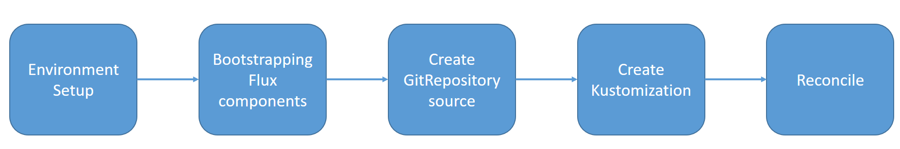

### Environment setup

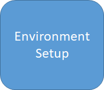

The workshop environment template pre-creates an AWS Cloud9 IDE environment, an Amazon ECR repository and an Amazon EKS cluster.

Open Cloud9 IDE environment by clicking on the `EKSCloud9EnvUrl` link from the base CloudFormation stack Outputs tab.

### Event Engine CloudFormation stack output

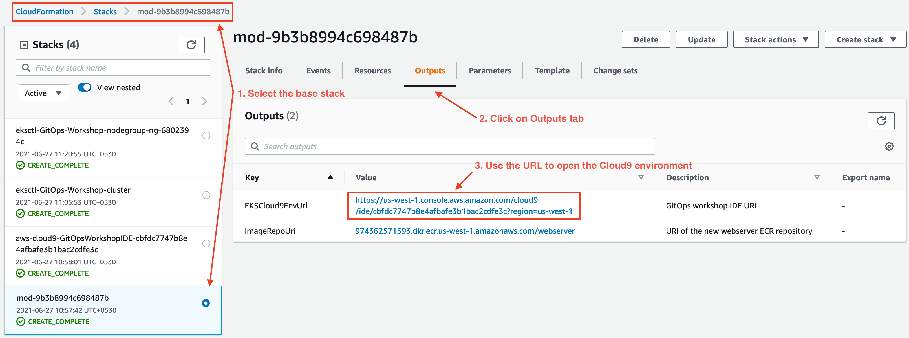

### Default AWS Cloud9 IDE view

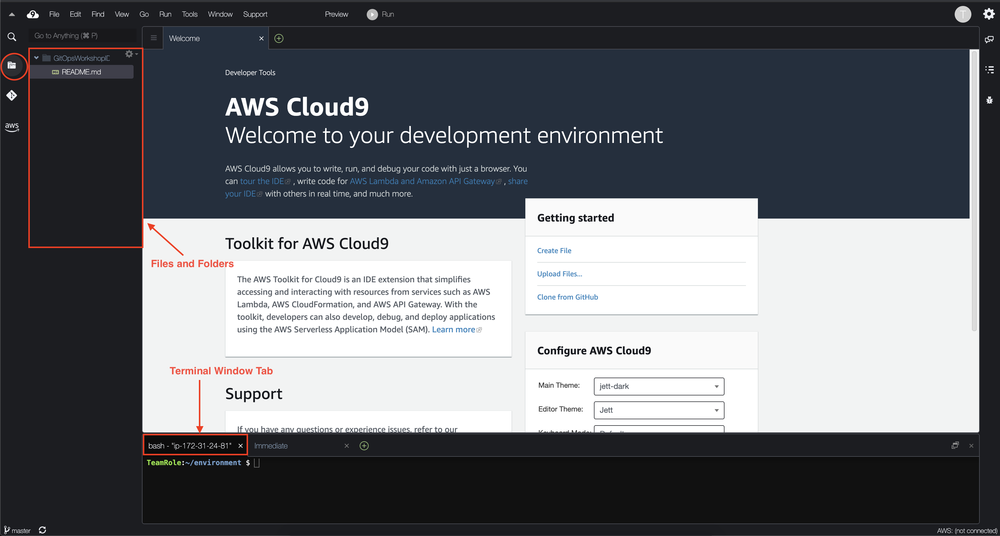

The IDE window may display a modal asking if third party content may be displayed in a WebView pane in the IDE window. Click No to discard the prompt.

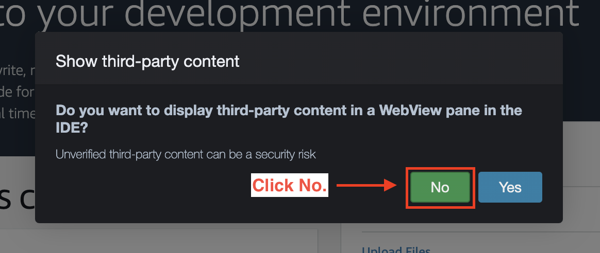

Next we’ll need some CLI tools to be installed in the Cloud9 environment for the workshop. For that we’ll first clone a public repository with the relevant installation scripts. Open the `Source Control` view as shown below and clone the [eks-init-scripts](https://github.com/iamsouravin/eks-init-scripts) repository.

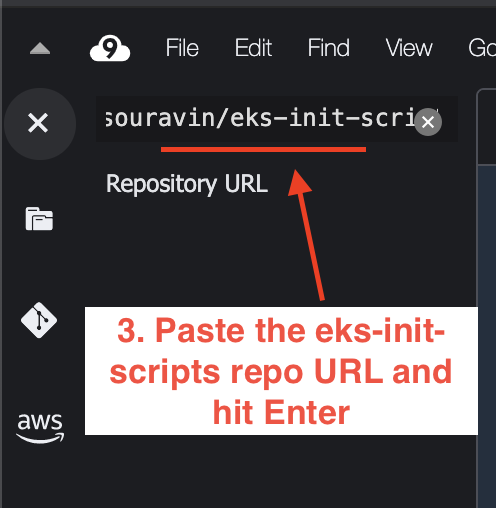

***Note:*** *The GitHub repo for init scripts can be found here:* [*https://github.com/iamsouravin/eks-init-scripts*](https://github.com/iamsouravin/eks-init-scripts)


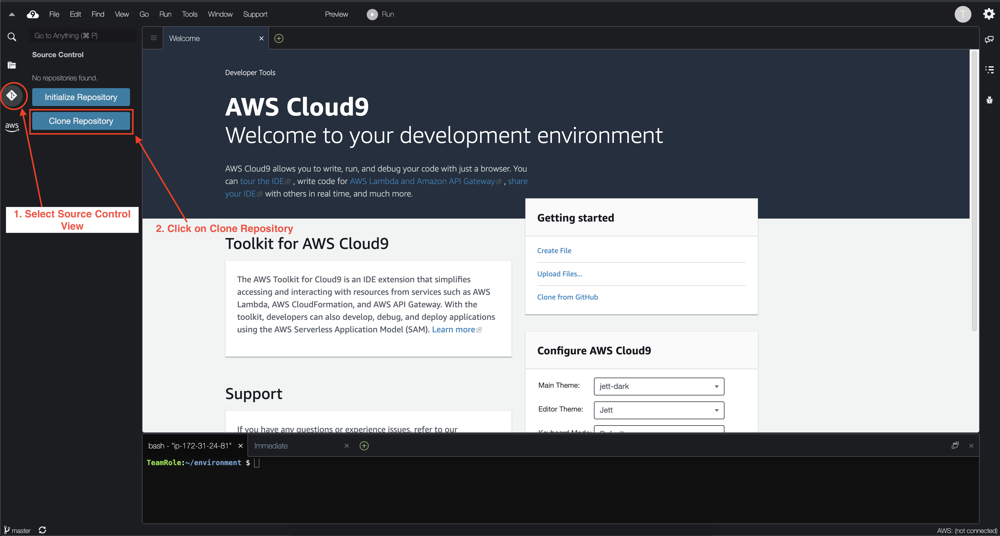

Confirm the clone location.
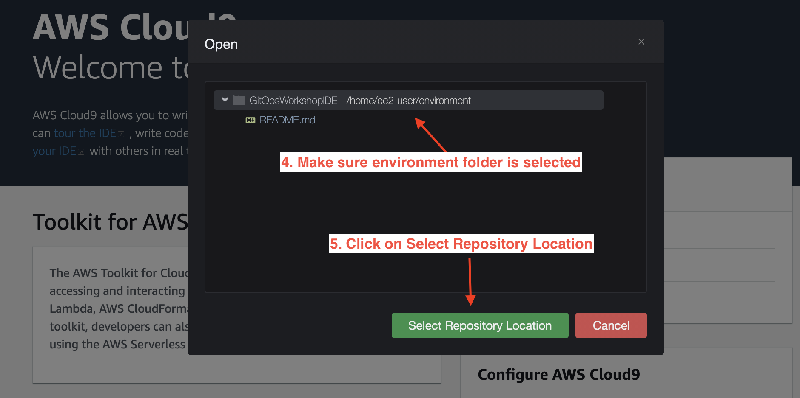

Source Control view should show the cloned repository in the left pane.
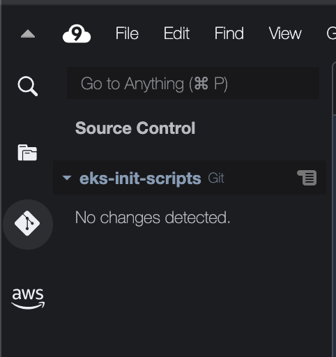

The environment directory should reflect the below structure.
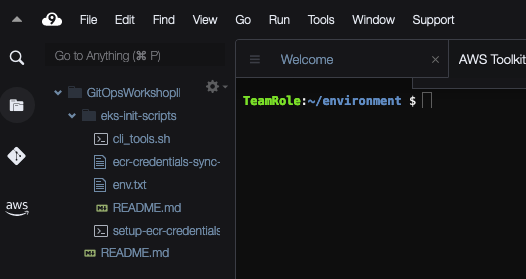


Open either a new terminal tab or access the existing tab and execute the `cli_tools.sh` shell script inside the cloned `eks-init-scripts` directory. The script installs tools like `jq`, `gettext`, `aws cli v2`, `kubectl`, `eksctl`, `helm` and `flux` binaries. It also exports the environment variables `AWS_ACCOUNT_ID`, `AWS_REGION` and `AWS_DEFAULT_REGION`. The script finishes off by adding a kubeconfig context of the EKS cluster where we’ll deploy flux components and application workloads.

```
cd ~/environment/eks-init-scripts
source ./cli_tools.sh
```

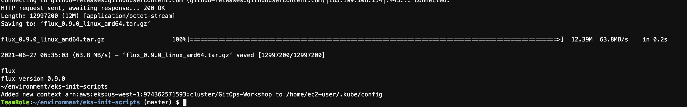
With the necessary tools installed next check if the cluster is accessible. List the nodes using **`kubectl get nodes`** to confirm the single worker node is **`Ready`**.

```
kubectl get nodes
NAME                                                 STATUS   ROLES    AGE    VERSION
ip-192-168-156-212.ap-southeast-1.compute.internal   Ready    <none>   112s   v1.19.6-eks-49a6c0
```

_**Setup the git environment**_

For the first part of the workshop we’ll use two GitHub repositories:
1) the app repository
2) the infra repository.

The app repository will host the application source code along with any build and deployment artifacts like Dockerfile and Kubernetes manifests. This repository will be typically maintained by the application team whereas the second repository is maintained by the infrastructure team. The infra repository will contain the `flux` related artifacts.

Refer to below links and setup the following:

* [GitHub -- Personal access token](https://help.github.com/en/github/authenticating-to-github/creating-a-personal-access-token-for-the-command-line)[](https://help.github.com/en/github/authenticating-to-github/creating-a-personal-access-token-for-the-command-line): For PAT

Ensure you grant full control of private repositories.

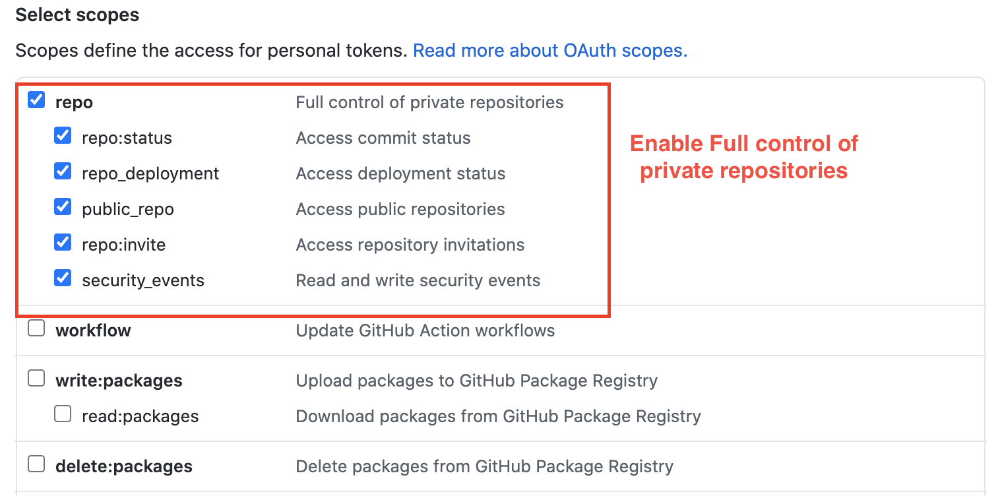

* [GitHub -- Setting your username](https://help.github.com/en/github/using-git/setting-your-username-in-git) : Setting the GitHub username

**Note:** The Git username is not the same as your GitHub username.

### Configure GitHub SSH Key

```
export GITHUB_USER_EMAIL=<Email>  # Email configured in your GitHub profile.
cd ~/.ssh
ssh-keygen -q -N "" -C $GITHUB_USER_EMAIL -f ./id_rsa
ssh-keyscan github.com > ./known_hosts
```

Copy the contents of `~/.ssh/id_rsa.pub` and add new SSH key in your GitHub account settings.

```
cat  ~/.ssh/id_rsa.pub #Copy the output
```

Navigate to https://github.com/settings/profile and click on `SSH and GPG keys`.

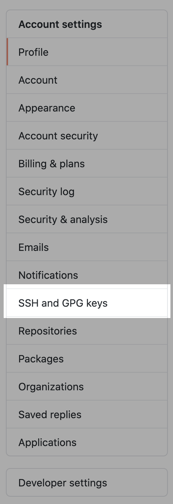

Click on `New SSH key` button and add the new key.

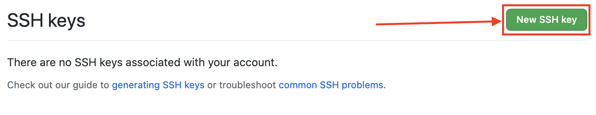

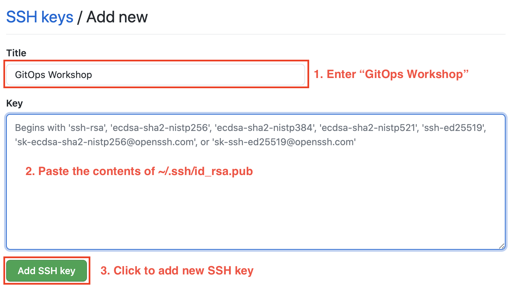

```
export GITHUB_TOKEN=<YOUR_GITHUB_TOKEN>
export GITHUB_USER=<YOUR_GITHUB_USERNAME>
export LOCAL_GIT_USERNAME=<Name>   # A friendly username to associate commits with an identity.
export GITHUB_INFRA_REPO=infra     # This will be created if not present by the flux cli during the bootstrap process.
export GITHUB_APP_REPO=gitops-demo # This is the main app repo that will be forked & cloned later in the workshop.
```


_**Setup git CLI**_

```
git config --global user.name $LOCAL_GIT_USERNAME
git config --global user.email $GITHUB_USER_EMAIL
git config --global credential.helper cache
```

### **Run the pre-requisite check**

```
flux check --pre
```

The flux project is evolving rapidly and you may find that the pre-check recommends a more recent version like below.

Below warning of upgrading flux version can be safely ignored. The workshop content has been tested with version 0.9.0 and it is ok to continue. We’ll incorporate more recent version in future versions of the workshop.
[README-7942fad0](images/README-7942fad0.png)

### Bootstrap flux tooling

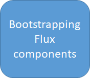

```
cd ~/environment
flux bootstrap github \
  --components-extra=image-reflector-controller,image-automation-controller \
  --owner=$GITHUB_USER \
  --repository=$GITHUB_INFRA_REPO \
  --branch=main \
  --path=./clusters/prod \
  --personal \
  --version 0.9.0

```

The `bootstrap` command sets up the GitHub repository that will host the GitOps toolkit components manifests for the `flux-system` namespace as well as the resources for application namespaces. The repository is created in your Github account if it doesn’t already exist. It commits the manifests for the flux components to the default branch at the specified path, installs the flux components in the EKS cluster, and configures the target cluster to synchronize with the specified path in the repository.

The table below explains the parameters to the `bootstrap` command.

|Name	|Description	|Default Value	|Supplied Value	|
|---	|---	|---	|---	|
|`--components-extra`	|List of additional controllers to install. Accepts a comma separated list.	|	|`image-reflector-controller,image-automation-controller`	|
|`--owner`	|Owner of the new GitHub repository.	|	|`$GITHUB_USER`	|
|`--repository`	|Name of the new GitHub repository.	|	|`$GITHUB_INFRA_REPO`	|
|`--branch`	|Default branch of the new GitHub repository.	|`main`	|`main`	|
|`--path`	|Path relative to the repository root. The cluster sync will be scoped to this path	|	|`./clusters/prod`	|
|`--personal`	|If set, the owner is assumed to be a GitHub user.	|Not set. Owner is assumed to be a GitHub org	|	|
|`--version`	|Flux toolkit version to install in the cluster.	|`latest`	|`0.9.0`	|
|	|	|	|	|

The `bootstrap` command creates the well-known `flux-system` directory at the configured path to host the flux internal components. The contents of the directory should resemble the following.

**Note:** Currently these files would be within “[https://github.com/$GITHUB_USER/${GITHUB_INFRA_REPO}.git](https://github.com/$GITHUB_USER/$%7BGITHUB_INFRA_REPO%7D.git)” and in one of the later steps, this would be cloned to your Cloud 9 instance.

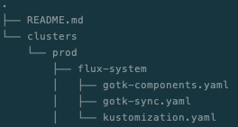

Later in the workshop we’ll create and commit the toolkit component manifests pointing to our application repository at the same path under `clusters/prod`.

### Verify flux is installed and running

```
flux check
```

### Fork application demo repository

For this workshop we are going to fork and clone a pre-created application demo repository containing Kubernetes manifests to deploy a simple **`nginx`** based webserver.

In a different browser tab navigate to https://github.com/iamsouravin/gitops-demo.
In the top-right corner of the page, click **`Fork`**.


### Clone the forked Github repo

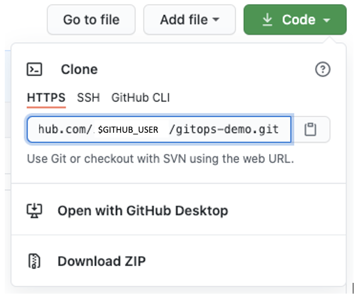

In the Cloud9 terminal change to the `environment` directory and run `git clone`

```
cd ~/environment
git clone git@github.com:$GITHUB_USER/${GITHUB_APP_REPO}.git
```

### Create a `GitRepository` `source` using flux

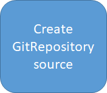

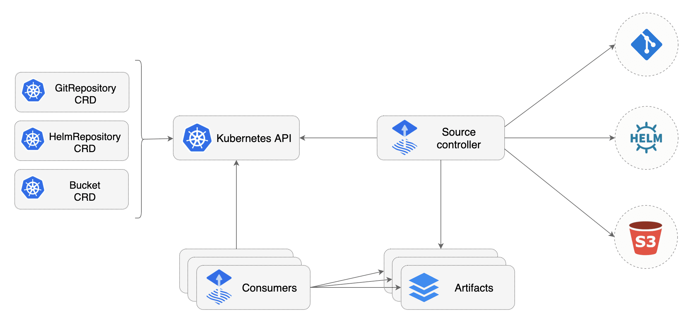

The `source-controller` component which gets installed in the cluster as part of the flux bootstrapping process polls an artifact source location like a git repo at configured intervals and reconciles any remote changes locally in the cluster. A `GitRepository` custom resource points to a source git repository and branch to clone. The controller clones the configured branch of the remote git repository and exposes the synchronized sources from Git as an artifact in a gzip compressed TAR archive (`<commit hash>.tar.gz`). This compressed artifact becomes the input for other components like `kustomize-controller` and `helm-controller`.

```
# Create a secret referring to the ssh identity created earlier
cd ~/.ssh
kubectl create secret generic ssh-credentials \
  -n flux-system \
  --from-file=identity=./id_rsa \
  --from-file=identity.pub=./id_rsa.pub \
  --from-file=./known_hosts

cd ~/environment
git clone https://github.com/$GITHUB_USER/${GITHUB_INFRA_REPO}.git
```


[**Optional**] Alternate option if above step asks for username and password.

```
git clone https://github.com/$GITHUB_USER/${GITHUB_INFRA_REPO}.git
Cloning into 'infra'...
Username for 'https://github.com/xxxxx/xxxx.git': <username>
Password for 'https://$GITHUB_USER@github.com/xxxxx/xxxx.git':<Personal access token>
```


```
#Switch to $GITHUB_INFRA_REPO directory
cd ~/environment/$GITHUB_INFRA_REPO

# Now create a GitRepository resource pointing to the application repo
flux create source git $GITHUB_APP_REPO \
  --url=ssh://git@github.com/$GITHUB_USER/$GITHUB_APP_REPO \
  --branch=main \
  --secret-ref=ssh-credentials \
  --interval=30s \
  --export > ./clusters/prod/$GITHUB_APP_REPO-source.yaml
```

The above command creates a `GitRepository` resource definition file pointing to our app GitHub repository and branch. The source will get synchronized every 30 seconds. The table below explains the parameters to the `flux create source git` command.

|Name	|Description	|Default Value	|Supplied Value	|
|---	|---	|---	|---	|
|`--url`	|Source repository URL.	|	|https://github.com/$GITHUB_USER/$GITHUB_APP_REPO	|
|`--branch`	|Source repository branch to reconcile.	|master	|main	|
|`--interval`	|Source repository sync interval.	|1m 0s	|30s	|
|`--export`	|Export the configuration in YAML format to stdout.	|	|	|
|	|	|	|	|

### Git commit and push

Let’s get our new `GitRespository` definition we created locally pushed to the infra repo.

```
cd ~/environment/$GITHUB_INFRA_REPO
git add -A && git commit -m "Add $GITHUB_APP_REPO GitRepository"
git push
```

### Check if the source is reconciled

Watch the latest commit hash from the app repo get reconciled by the `source-controller`.

**Note:** You may have to wait for up-to a min for “gitops-demo” to start reflecting.

```
watch flux get source git

#Expected output
NAME            READY   MESSAGE                                                         REVISION                                        SUSPENDED
flux-system     True    Fetched revision: main/554ce6638ad7ec9c466818182ccbecd09fcb0923 main/554ce6638ad7ec9c466818182ccbecd09fcb0923   False    
gitops-demo     True    Fetched revision: main/69d33a8b41f56204352227eea56571f9fd4f96da main/69d33a8b41f56204352227eea56571f9fd4f96da   False
```

Confirm that an archive file with the latest commit hash is created by the `source-controller`.

```
kubectl exec -it \
  `kubectl get pods -o json \
  -l 'app=source-controller' \
  -n flux-system \
  -o jsonpath='{.items[0].metadata.name}'` \
  -n flux-system -- \
  ls -l /data/gitrepository/flux-system/gitops-demo
```


Now that we got our sources sync’ed let’s setup the deployment pipeline.

### Create `Kustomization` resource to deploy the `webserver` app


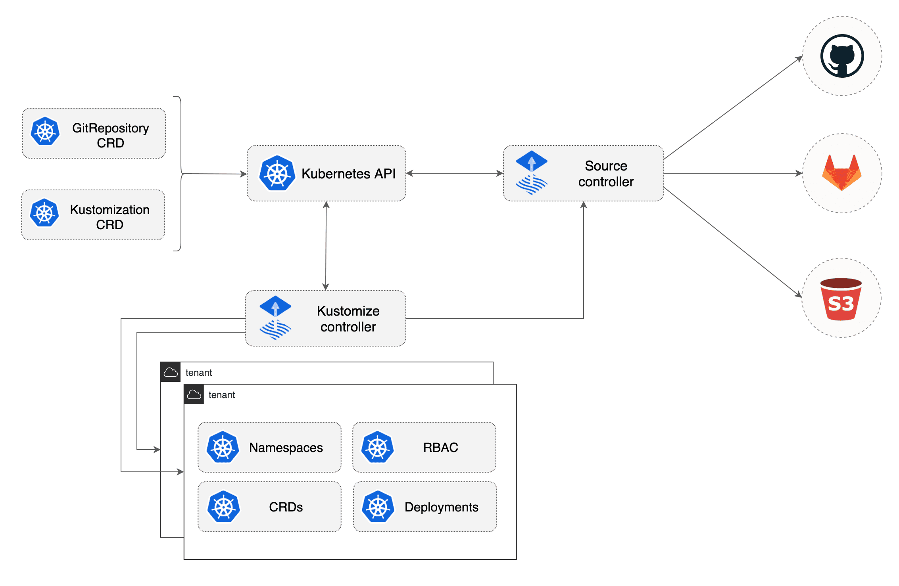

The `kustomize-controller` is another Kubernetes operator that gets installed in the cluster as part of the bootstrap process. It works with a `Kustomization` CRD. The `Kustomization` CRD points to Kubernetes manifest source artifact locations that are synced by the `source-controller`. The `kustomize-controller` assembles the manifests with [Kustomize](https://kustomize.io/) to form a continuous delivery pipeline. The controller is responsible for reconciling the cluster state with the source state as received from the `source-controller`. Pruning ensures any resources removed in the source also gets removed from the cluster. Client validation ensures that all the manifests are first validated by doing a dry-run apply. The controller also keeps track of the health of the deployed workloads and reflects it in the reconciliation status.

```
cd ~/environment/$GITHUB_INFRA_REPO
flux create kustomization $GITHUB_APP_REPO \
  --source=$GITHUB_APP_REPO \
  --path="./kustomize" \
  --prune=true \
  --validation=client \
  --interval=1m \
  --export > ./clusters/prod/$GITHUB_APP_REPO-kustomization.yaml
```

The above command creates a `Kustomization` resource definition file pointing to the source path of the deployment manifests sync’ed by the `source-controller`. The manifests will get synchronised every 1 minute. The table below explains the parameters to the `flux create kustomization` command.

|Name	|Description	|Default Value	|Supplied Value	|
|---	|---	|---	|---	|
|`--source`	|Source that contains the Kubernetes manifests.	|	|$GITHUB_APP_REPO	|
|`--path`	|Path to the directory containing `kustomization.yaml`.	|./	|./kustomize	|
|`--prune`	|Enable garbage collection.	|	|	|
|`--validation`	|Validate manifests before applying.	|	|client	|
|`--interval`	|Source sync interval	|1m0s	|1m	|
|`--export`	|Export the configuration in YAML format to stdout.	|	|	|

### Git commit and push

```
git add -A && git commit -m "Add $GITHUB_APP_REPO Kustomization"
git push
```

### Watch Flux sync the application

Note: wait for up-to a minute for “gitops-demo" kustomizations to be available.

```
watch flux get kustomizations
```

Expected Output:
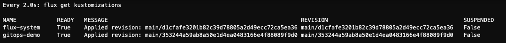
### Check deployment

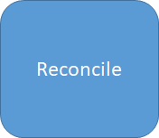

```
kubectl get deployment webserver

NAME        READY   UP-TO-DATE   AVAILABLE   AGE
webserver   2/2     2            2           6h2m
```

### Flux reverts cluster changes

Flux `kustomiz-controller` tracks the values defined in the Kubernetes manifests in the app repo and continuously reconciles the cluster state to match the intents defined in the manifests. In our current deployment manifest we have set the replica count to 2.

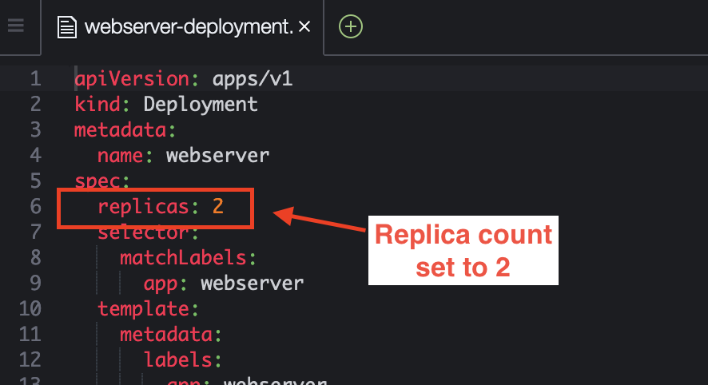

We’ll verify that flux reverts any cluster changes by scaling down the deployment replica count to zero using `kubectl` and watching the deployment getting scaled back up to the pre-defined count.

In the terminal tab run below command to scale the deployment replica count to 0.

```
kubectl scale deployment/webserver --replicas=0
```

Watch the replicas getting restored to original replica count. It takes around a minute depending on the configured synchronization interval.

```
watch kubectl get deployment webserver
```


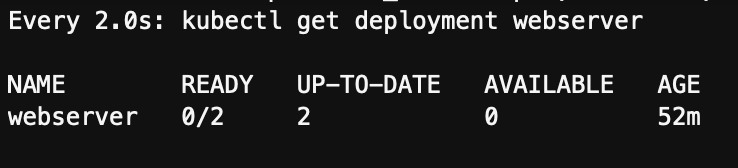

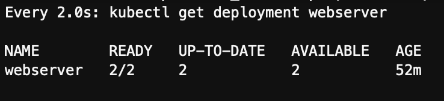


### Flux reconciles new git changes


Get the load balancer endpoint. The load balancer FQDN can be found  under EXTERNAL_IP column.

```
kubectl get service webserver
NAME        TYPE           CLUSTER-IP      EXTERNAL-IP                                                                      PORT(S)        AGE
webserver   LoadBalancer   10.100.16.238   ad062fbbeb9dc40898eeebc8e51dff79-4a9fc623faba144f.elb.ap-south-1.amazonaws.com   80:32675/TCP   6h11m

```

In _**another terminal window**_ watch the server endpoint and notice that the server hostname and IP keeps changing

```
export SERVICE_HOST=`kubectl get service webserver \
  -o jsonpath='{.status.loadBalancer.ingress[0].hostname}'`

watch curl --silent [http://$SERVICE_HOST/plain.txt](http://ad062fbbeb9dc40898eeebc8e51dff79-4a9fc623faba144f.elb.ap-south-1.amazonaws.com/plain.txt)
```

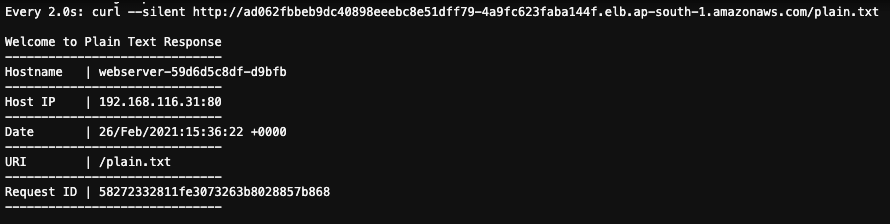

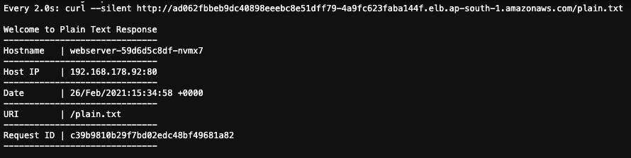


Open `$GITHUB_APP_REPO/kustomize/webserver-configmap.yaml` in a Cloud9 editor

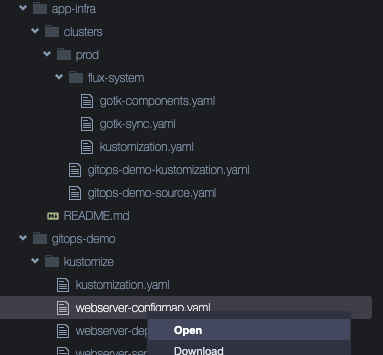

Add a line to `plain.txt` key
`Footnote: This is loaded from configMap`

**Note:** Ensure that space used for indentation matches above text of the section. Else it may fail due to incorrect YAML syntax.

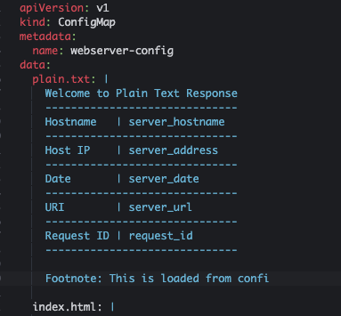

Save the change.
Git commit and push to origin.

```
cd ~/environment/${GITHUB_APP_REPO}
git commit -a -m "Add footnote"
git push
```

Switch to the other terminal tab where the watch on curl was set up. The footnote should appear as the source change is first reconciled and the kustomization is pushed out to the cluster.

**Note:** Wait for up-to 60-90 seconds for Flux to pick these modifications and then eventually update the existing Kubernetes deployment.

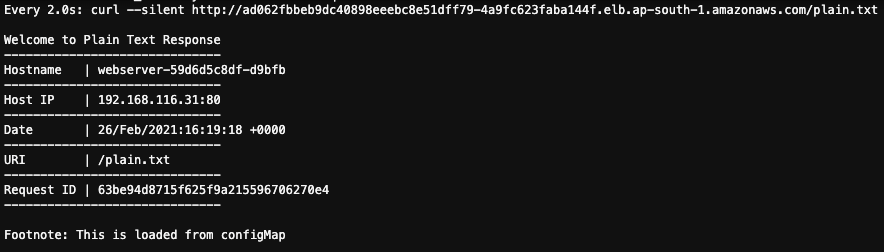

### Suspend Kustomization reconciliation

Flux allows you to suspend reconciliation for either source or kustomization.

* Suspending source will prevent any new kustomization changes to be reconciled from source.
* However, suspending only kustomization will not suspend source reconciliation.

```
flux suspend kustomization $GITHUB_APP_REPO
► suspending kustomizations gitops-demo in flux-system namespace
✔ kustomizations suspended
```

Checkout previous commit by noting the commit hash from `git log --oneline` output

```
git log --oneline
```

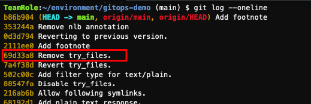

Let’s try to revert to one of the previous commit “69d33a8”

```
cd ~/environment/${GITHUB_APP_REPO}
git checkout 69d33a8 .
git commit -a -m "Revert the footnote"
git push
```

**Expected Output:**
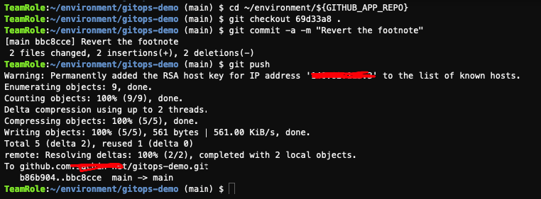

Note that `source` `Suspended` column shows `False` and gets reconciled.

```
flux get source git $GITHUB_APP_REPO
NAME        READY  MESSAGE                                                         REVISION                                      SUSPENDED
gitops-demo True   Fetched revision: main/0d3d79455ce0768f489d2cfbfe56c93078bca2c5 main/0d3d79455ce0768f489d2cfbfe56c93078bca2c5 False
```

`kustomization` however shows `Suspended` column as `True` and is still at previous revision. If you recall, kustomization was suspended in one of the previous step, due to which it showing `Suspended` as

```
flux get kustomization $GITHUB_APP_REPO
NAME        READY  MESSAGE                                                         REVISION                                      SUSPENDED
gitops-demo True   Applied revision: main/2111ee0e5018aee3b763a5fe744faba76819c469 main/2111ee0e5018aee3b763a5fe744faba76819c469 True
```

### Resume Kustomization reconciliation

Now let’s resume the kustomization to see the footnote getting reverted.

```
flux resume kustomization $GITHUB_APP_REPO
► resuming kustomizations gitops-demo in flux-system namespace
✔ kustomizations resumed
◎ waiting for Kustomization reconciliation
✔ Kustomization reconciliation completed
✔ applied revision main/0d3d79455ce0768f489d2cfbfe56c93078bca2c5
```

Terminate the watch on curl that we had set in another terminal. Now we’re going to check how to undeploy our application.

### Undeploy the application

Let’s see if we can simply delete the `Kustomization` custom resource to undeploy the application.

```
flux delete kustomization $GITHUB_APP_REPO  
#expected output                                                                                                                    
Are you sure you want to delete this kustomizations: y█
► deleting kustomizations gitops-demo in flux-system namespace
✔ kustomizations deleted
```

```
kubectl get deployment webserver
#expected output
Error from server (NotFound): deployments.apps "webserver" not found
```

On first glance it does seem like it has got the job done. However, do note that this does not remove the `Kustomization` resource from the `$GITHUB_INFRA_REPO` repository. The reconciliation process will restore the `Kustomization` resource from the source and redeploy the application. You may have to wait for around a minute since we had configured our sync interval to 1 minute when we created the `Kustomization` resource.

**Note:** In some cases it was even taking upto 5-8 minutes for customization resource to reflect.

```
watch flux get kustomization $GITHUB_APP_REPO
NAME        READY  MESSAGE                                                         REVISION                                      SUSPENDED
gitops-demo True   Applied revision: main/0d3d79455ce0768f489d2cfbfe56c93078bca2c5 main/0d3d79455ce0768f489d2cfbfe56c93078bca2c5 False
```

```
kubectl get deployment webserver
NAME      READY UP-TO-DATE AVAILABLE AGE
webserver 2/2   2          2         7m52s
```


To ensure the `Kustomization` resource gets deleted permanently delete the `./clusters/prod/$GITHUB_APP_REPO-kustomization.yaml` file from the `$GITHUB_INFRA_REPO` repository.

```
cd ~/environment/$GITHUB_INFRA_REPO
git rm clusters/prod/$GITHUB_APP_REPO-kustomization.yaml
git commit -a -m "Removing $GITHUB_APP_REPO Kustomization"
git push   # May ask for username and password
```

Validate that kustomization resource is been deleted.

```
watch flux get kustomization $GITHUB_APP_REPO
```

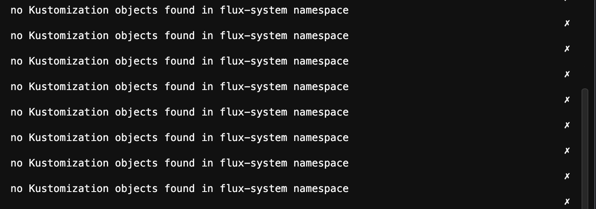

Delete the `GitRepository` resource file at `./clusters/prod/$GITHUB_APP_REPO-source.yaml` from the `$GITHUB_INFRA_REPO` repository to remove the source configuration.

```
cd ~/environment/$GITHUB_INFRA_REPO
git rm clusters/prod/$GITHUB_APP_REPO-source.yaml
git commit -a -m "Removing $GITHUB_APP_REPO GitRepository"
git push
```

Now validate that git as source is been deleted from flux.

```

watch flux get source git $GITHUB_APP_REPO
```

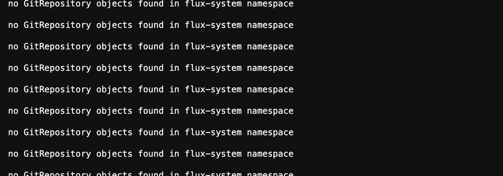

**This completes the first part of the workshop.**
* * *
* * *
* * *

## Section 2: Image Reconciliation

**Complexity of this section** : Advanced (Level 300)

This section of the workshop will configure scanning container image tags and deployment roll-outs with Flux.

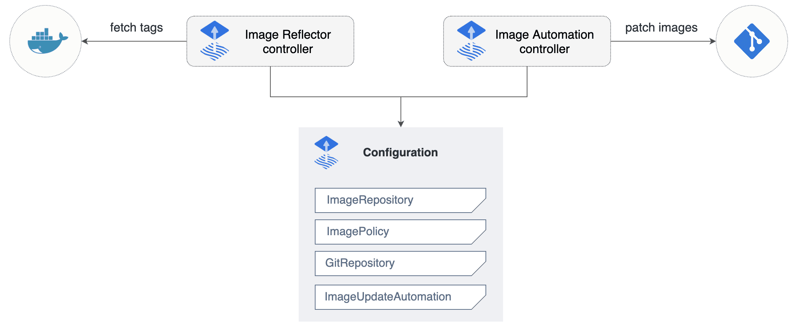

* scan the container registry and fetch the image tags
* select the latest tag based on the defined policy (semver, calver, regex)
* replace the tag in Kubernetes manifests (YAML format)
* checkout a branch, commit and push the changes to the remote Git repository
* apply the changes in-cluster and rollout the container image

### Revert the source and kustomization to redeploy the application

In the previous section we uninstalled the application by removing the source and kustomization resource files from our infra repo. Before we get to the image automation part we’ll revert our earlier delete commits from the repo.

We’ll first list the commit log and note down the commit IDs of the last two commits. Please note that the commit IDs in the log output will be different for your repository.

```
cd ~/environment/$GITHUB_INFRA_REPO
git log
```

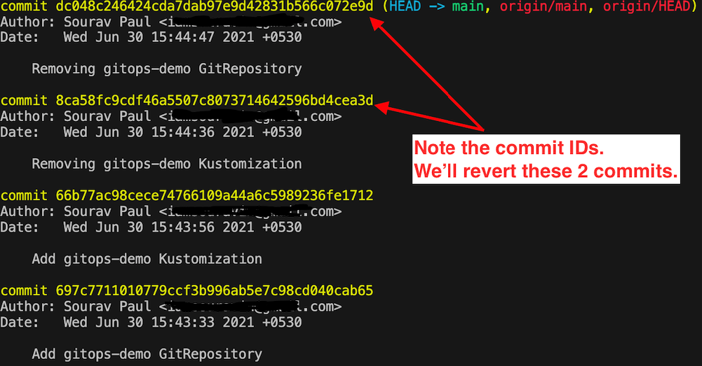

Next, we’ll use `git revert` to revert the changes one by one.

```
# Replace with commit ID for your repo
git revert --no-edit dc048c246424cda7dab97e9d42831b566c072e9d
```
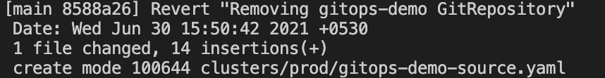

```
# Replace with commit ID for your repo
git revert --no-edit 8ca58fc9cdf46a5507c8073714642596bd4cea3d
```

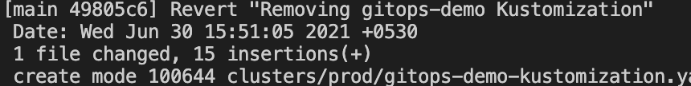

Checking `git log`  again should show two new commits to revert the earlier changes.

```
git log
```

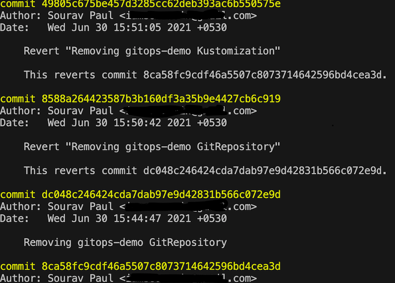

Push the reverted commits.

```
git push
```

Wait a minute to reconcile the resources before moving on. Once the reconciliation is done the application should get redeployed in the cluster.

This also showcases how easy it is to track cluster changes and revert any catastrophic changes.

### Setup cron job to synchronize ECR login token every 6 hours

```
cd ~/environment/eks-init-scripts
source setup-ecr-credentials-sync.sh GitOps-Workshop
```

### Create an `ImageRepository` resource pointing to our private ECR repo

Note that the resource refers to `$ECR_SECRET_NAME` variable which is exported from the previous step. The `image-reflector-controller` uses the secret reference to login to the ECR repository.

```
cd ~/environment/$GITHUB_INFRA_REPO
flux create image repository $GITHUB_APP_REPO \
--image=$AWS_ACCOUNT_ID.dkr.ecr.$AWS_REGION.amazonaws.com/webserver \
--secret-ref=$ECR_SECRET_NAME \
--interval=30s \
--export > ./clusters/prod/$GITHUB_APP_REPO-repository.yaml
```

The arguments are self-explanatory. Go ahead and push the changes to `$GITHUB_INFRA_REPO`.

```
git add -A && git commit -m "Add ECR ImageRepository"
git push
```

Verify the image repository resource.

```
watch flux get image repository $GITHUB_APP_REPO
```

**Note:** This may take up-to a minute to start reflecting in output

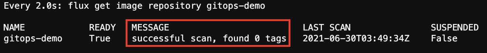

Here it is showing as  `0 tags` since we still do not have any images been pushed to Amazon Elastic Container Registry.

### Create an `ImagePolicy` resource to filter, sort and select image tags from ECR repository

An `ImagePolicy` resource defines the rules to filter, sort and select image tags from the image repository. Flux supports `semver` ranges out of the box. In addition the `image-reflector-controller` also supports regular expression based image filtering.

For regular expression based filtering, sorting can be either ascending or descending. The regular expression syntax follows the Go programming language syntax. The pattern specified for `--filter-regex` argument below looks for image tags which start with the fixed prefix ‘`main-`’, followed by an alphanumeric section, followed by a ‘`-`’ character, and ending with a numeric section. The end numeric section specifies a named capturing group ‘`ts`' to capture the Unix epoch timestamp when the image was created. The `--filter-extract` argument refers to the named capturing group from the `--filter-regex` pattern to use for sorting. The `--select-numeric` argument applies numeric sorting and the value ‘`asc`’ determines the direction of sort to be ascending. The three arguments together form the tag selection rule to choose the latest tag based on epoch timestamp.


```
flux create image policy $GITHUB_APP_REPO \
--image-ref=$GITHUB_APP_REPO \
--filter-regex='^main-[a-fA-F0-9]+-(?P<ts>[1-9][0-9]*)' \
--filter-extract='$ts' \
--select-numeric=asc \
--export > ./clusters/prod/$GITHUB_APP_REPO-policy.yaml
```

Now we have defined a policy to select the latest tag. Go ahead and push the changes to `$GITHUB_INFRA_REPO`.

```
git add -A && git commit -m "Add ECR ImagePolicy"
git push
```


Verify the image policy resource. It will complain about empty version list. This is ok because our ECR repo is empty.

**Note:** This may take up-to a minute to start reflecting in output

```
watch flux get image policy $GITHUB_APP_REPO
```

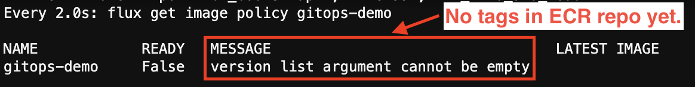

### Create an `ImageUpdateAutomation` resource to update the latest image tag in the deployment manifests

```
cd ~/environment/$GITHUB_INFRA_REPO
cat > ./clusters/prod/$GITHUB_APP_REPO-automation.yaml << EOF
apiVersion: image.toolkit.fluxcd.io/v1alpha2
kind: ImageUpdateAutomation
metadata:
  name: gitops-demo
  namespace: flux-system
spec:
  sourceRef:
    kind: GitRepository
    name: gitops-demo
  git:
    checkout:
      ref:
        branch: main
    push:
      branch: main
    commit:
      author:
        email: fluxcdbot@users.noreply.github.com
        name: fluxcdbot
      messageTemplate: '{{range .Updated.Images}}{{println .}}{{end}}'
  update:
    path: ./kustomize
    strategy: Setters
  interval: 1m0s
EOF
```

The `image-automation-controller` will checkout the source repo, locate all the manifest files based on  `update.path` field, commit the changes with commit message from the `messageTemplate` field and push the changes back to the source repo. The `messageTemplate` in the above resource definition will list down the updated image tags in the commit message. The `update.path` field restricts the updates to resources under the `./kustomize` directory only. The controller will update the manifest files at places where it finds placeholder comments like the following:


# {“$imagepolicy”: “flux-system:<source repo>”}
# {“$imagepolicy”: “flux-system:<source repo>:name”}
# {“$imagepolicy”: “flux-system:<source repo>:tag”}


```
git add -A && git commit -m "Add source repo ImageUpdateAutomation"
git push
```

Verify the image update automation resource.

```
watch flux get image update
```

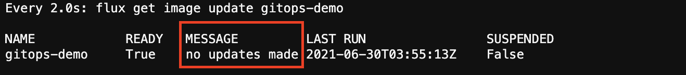

### Setup application assets to support image update automation

Now that we have defined all the flux resources for image update automation we have to update the relevant manifest files in the source repo for the image updation to work.

Flux supports updation of image tags in native Kubernetes resources like Deployment, StatefulSet, DaemonSet, CronJob. In addition Flux is also able to update custom resources like HelmRelease, Kustomization and Tekton Task resource.

In this part of the workshop we’ll create files for static resources and server configuration, remove the corresponding configMap references, build our own private image, and push it to our private ECR repository. The image name and tag will be overridden through `./kustomize/kustomization.yaml` overlay file.

The changes are already available in `image-automation` branch. Go ahead and merge to `main` and push the merge commit.

```
cd ~/environment/$GITHUB_APP_REPO
git pull
git merge origin/image-automation
```

Merge will open up commit editor. In the Cloud9 environment it will most probably be `nano`. Accept the changes and hit `^X` (`<Ctrl>+X`) to exit the editor.

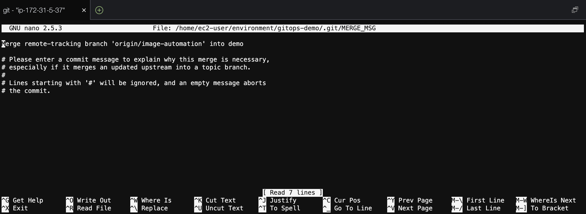

**Sample Output:**

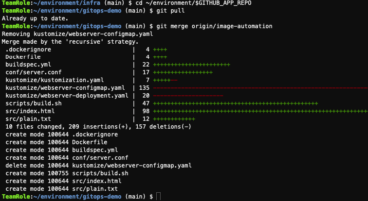

Once the merge is done push the changes to `origin`.

```
git push
```

Placeholders in `./kustomize/kustomization.yaml` overlay file tell the `image-automation-controller` where and which part of the image reference to update.

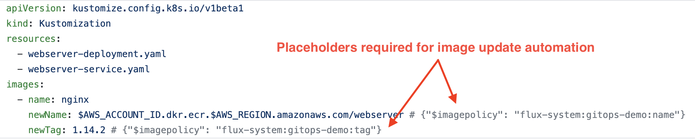

As soon as the ./kustomize/`kustomization.yaml` is reconciled in the cluster the deployment will break momentarily because of the `$AWS_ACCOUNT_ID` and `$AWS_REGION` variables in the `newName` field and also because we currently do not have any images in our repo. We’ll get to that shortly.

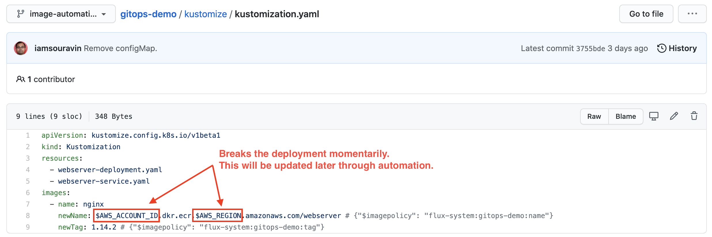


The Dockerfile in base directory is very simple. It copies the static assets and conf file to the `nginx` server locations and builds the image.

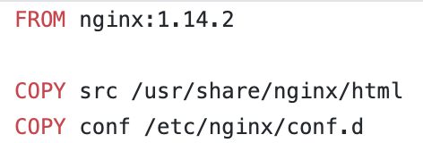

Now we’ll split the terminal pane into 4 rows to get simultaneous feedback from the image repository, policy and update automation resources.


1. Right click on the terminal tab and select `Split Pane in Two Rows`.

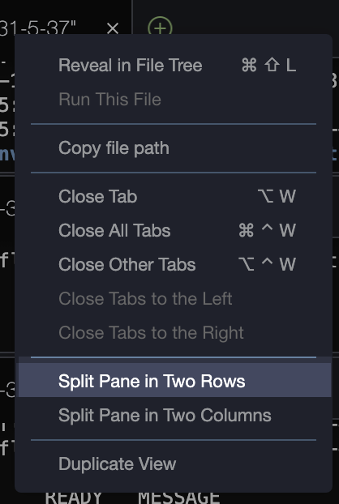


2. Repeat step 1 by right clicking on the first pane two more times to have the below pane configuration.

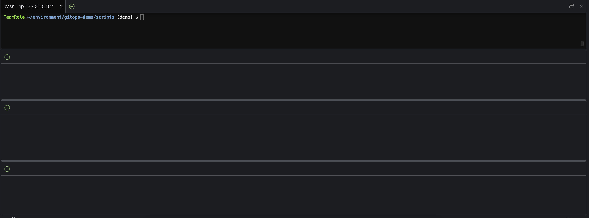

3. Open New Terminal windows in each of the new panes by clicking the `+` icon at the top left corner of each new pane and selecting New Terminal option.

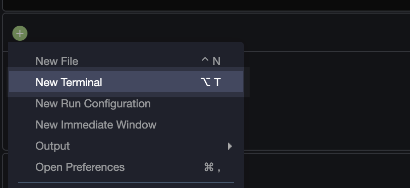

4. Finally you should have four vertically stacked terminal windows.

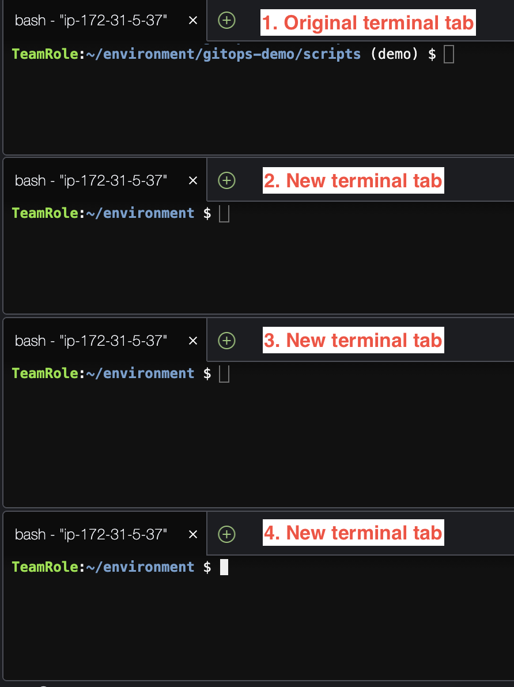

Export GITHUB_APP_REPO environment variable in each of the new terminal windows and set three different watch commands on the new terminal windows.

_**New terminal tab 1**_

```
#image repository
export GITHUB_APP_REPO=gitops-demo
watch flux get image repository $GITHUB_APP_REPO
```

_**New terminal tab 2**_

```
#image policy
export GITHUB_APP_REPO=gitops-demo
watch flux get image policy $GITHUB_APP_REPO
```

_**New terminal tab 3**_

```
#image update
export GITHUB_APP_REPO=gitops-demo
watch flux get image update $GITHUB_APP_REPO
```

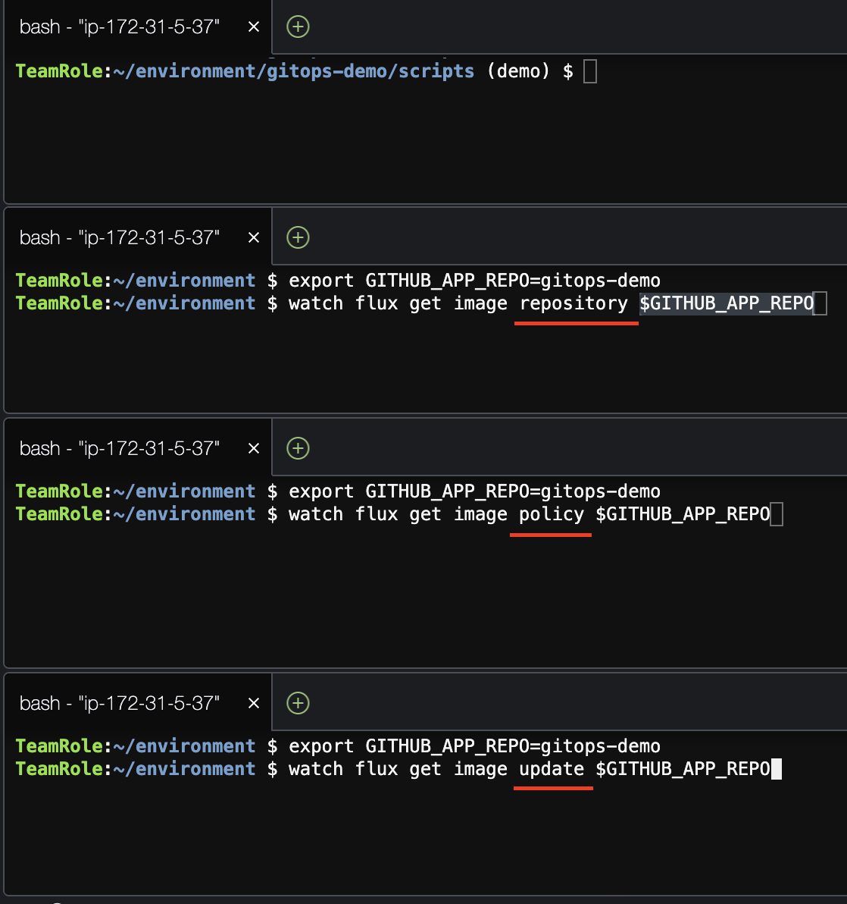

Next, to keep the workshop simple we are going to build the image in our local Cloud9 environment and push to our private ECR repository.

In the original terminal tab execute the following commands.

Validate that you are on the original terminal:

```
#Execute this from original terminal to validate that environment variables are set
export | grep -i "AWS_DEFAULT_REGION\|AWS_ACCOUNT_ID"
```


```
cd ~/environment/$GITHUB_APP_REPO/scripts
./build.sh webserver
```

**Expected output:**
Ensure that none of the environment variables are blank.

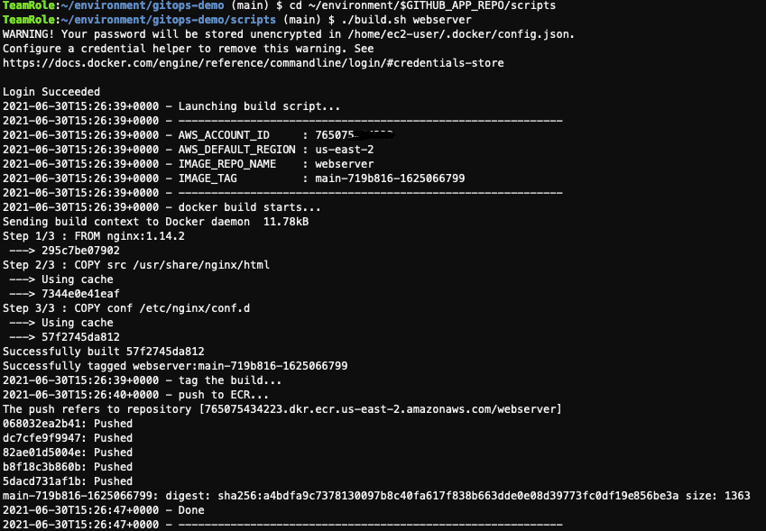

The build script will create a new image tag and push it to the ECR repo. Watch the new tag getting reconciled and committed to the source repo in the below terminals.

**Note:** You may have to wait for up-to a min for flux reconciliation to kick-in and start reflecting.

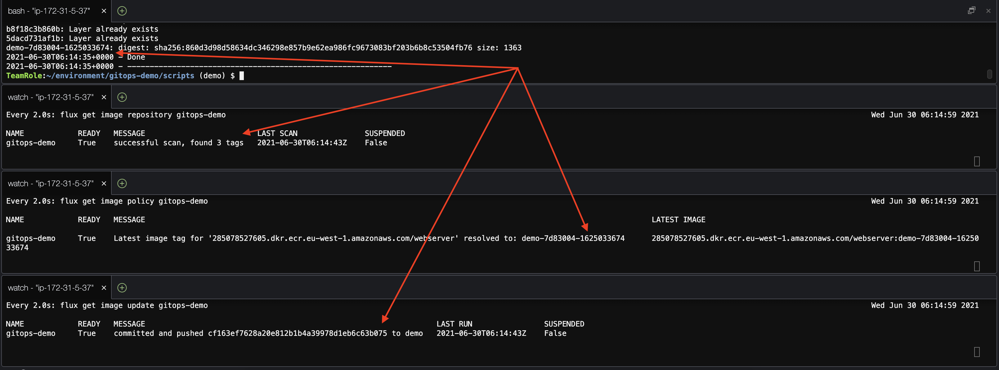

Verify that the image tag is updated in the cluster deployment resource.

```
kubectl get deployment/webserver -o jsonpath='{.spec.template.spec.containers[0].image}'
```

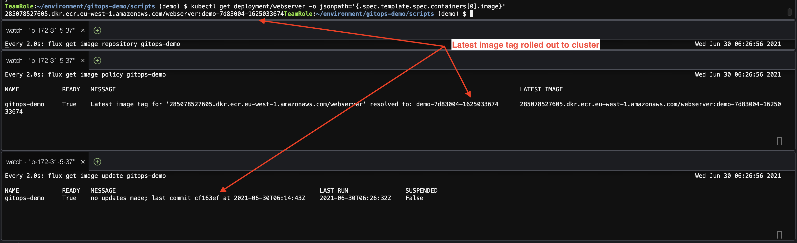

Verify that the pods are running fine.

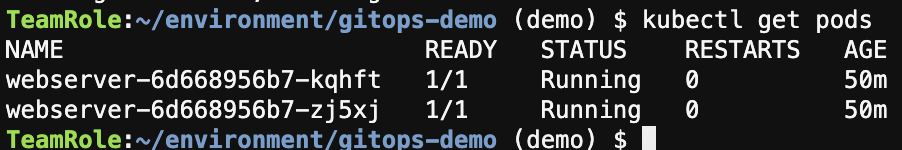

Verify that the change is indeed reflected in your GitHub repo. The branch as shown below will depend on the source repo push configuration for the `ImageUpdateAutomation` resource. For the workshop content the branch will be `main`.

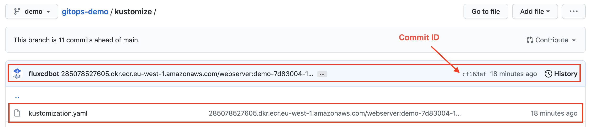

* * *

### Clean up application resources

As a good practice it is always recommended to clean up after yourself. Run the below commands to remove the app related flux resources from the `$GITHUB_INFRA_REPO` repository.

```
cd ~/environment/$GITHUB_INFRA_REPO
git rm clusters/prod/gitops*
git add -A && git commit -m "Remove $GITHUB_APP_REPO resources"
git push
```

The changes should get reconciled back in the cluster within a minute. Wait for a minute and verify that the deployment is deleted in the default namespace.

```
kubectl get deployments
```

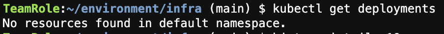

### Uninstall flux

As a final step, before we wrap this workshop, go ahead and remove all flux components from the cluster.

```
flux uninstall
```

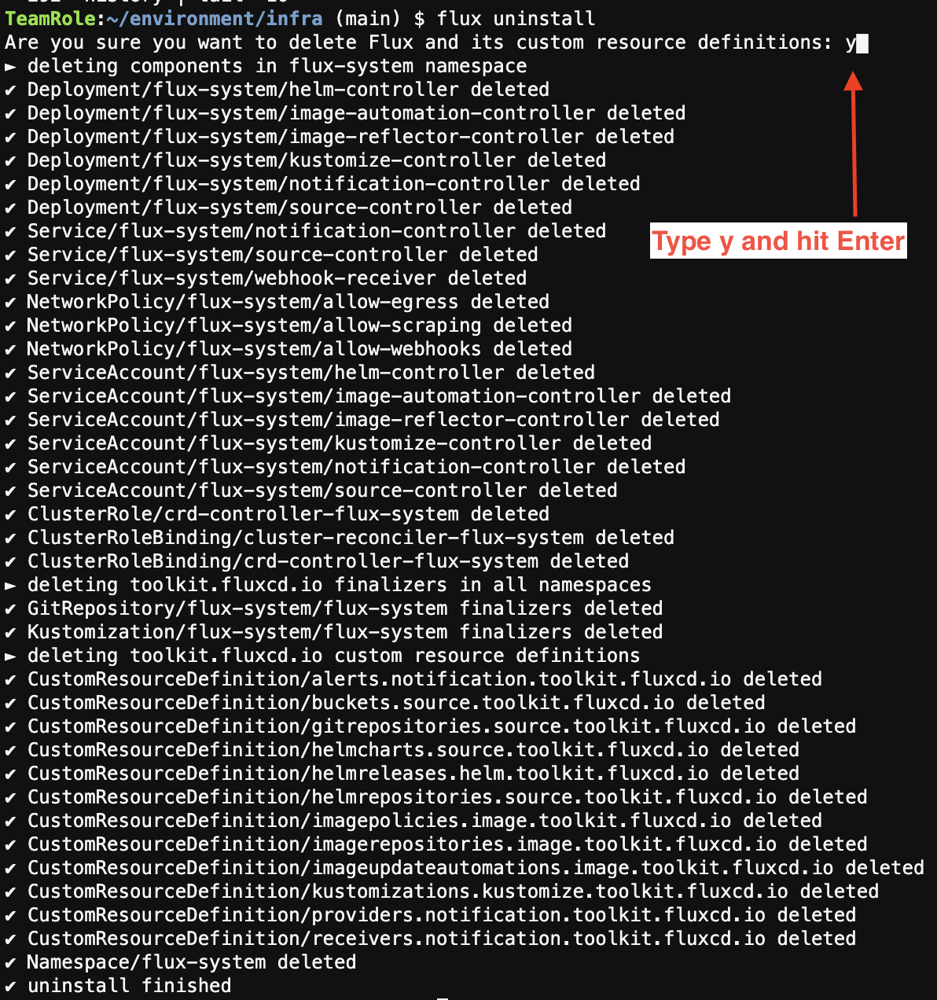

Congratulations! You have completed the workshop! 🎉

Please fill in the Survey to share your experience about this workshop.
